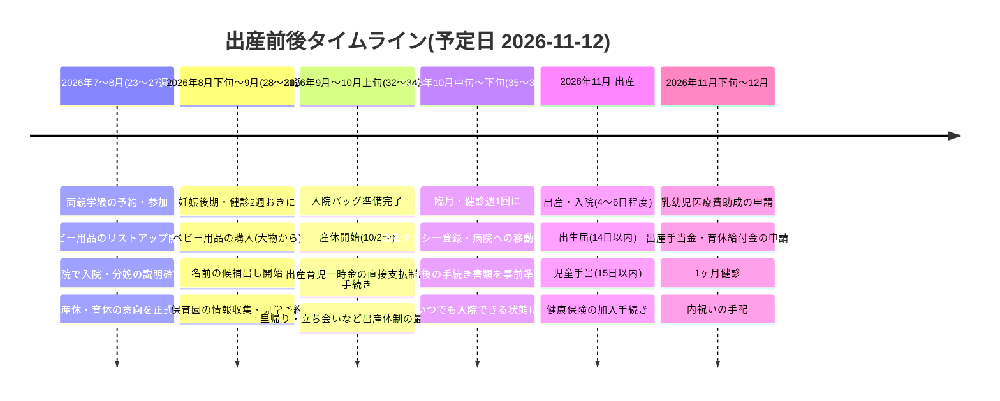

# 出産前後やることタイムライン

**出産予定日:2026年11月12日(木)**(40週0日)

| 節目 | 週数 | 日付の目安 |
|---|---|---|
| 現在 | 23週ごろ(妊娠6ヶ月) | 2026年7月19日 |
| 妊娠後期スタート(8ヶ月) | 28週0日 | 2026年8月20日 |
| 産前休業 開始可能日 | 34週+ | 2026年10月2日 |
| 臨月(健診が週1回に) | 36週0日 | 2026年10月15日 |
| 正期産(いつ生まれてもOK) | 37週0日 | 2026年10月22日 |
| 出産予定日 | 40週0日 | 2026年11月12日 |

- 詳細チェックリスト → [checklist.md](checklist.md)
- 検討すべきこと(意思決定リスト) → [kento.md](kento.md)
- **わが家専用プラン(豊島区・回答反映版)** → [my-plan.md](my-plan.md)
- 育休中の経済的援助まとめ(いくらもらえるか) → [okane.md](okane.md)
- **申請手続き一覧(誰が・どこに・いつまでに・何を)** → [tetsuzuki.md](tetsuzuki.md)
- **会社・健保に確認することリスト(送れる文面つき)** → [kaisha.md](kaisha.md)

---

## タイムライン概要

